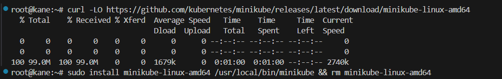
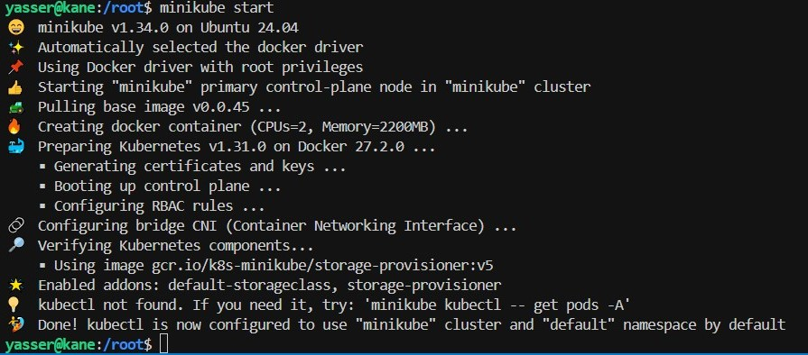

# Assignment 4 - Task 1 - Solution

**Trainee Name: Yasser Ahmed**  
**Group: ALX2_SWD1_G1**  

## Table of Contents

1. [Installing minikube](#1--install-k8s-cluster-minikube)

### 1- Install k8s cluster (minikube)


*installation process of minikube.*


*Start minikube process*

---

### 2- Create a pod with the name `redis` and with the image `redis`.

#### redis-pod.yaml

```yaml
  name: redis
  labels:
    app: redis
spec:
  containers:
  - name: redis-c-1
    image: redis
    ports:
    - containerPort: 6379
```

### 3- Create a pod with the name `nginx` and with the image `nginx123`

#### nginx-pod.yaml

```yaml
apiVersion: v1
kind: Pod
metadata:
  name: nginx
  labels:
    app: nginx
spec:
  containers:
  - name: nginx-c-1
    image: nginx123     # intentionally wrong image name for testing
    ports:
    - containerPort: 80
```

```bash
yasser@kane:~/k8s$ k create -f assignment-4/task-1
pod/nginx created
pod/redis created
```

```bash
yasser@kane:~/k8s$ k get pods 
NAME    READY   STATUS         RESTARTS   AGE
nginx   0/1     ErrImagePull   0          71s
redis   1/1     Running        0          70s
```

---

### 4- What is the nginx pod status?

for pod named `nginx` the status is "ErrImagePull" becaus we intentionally using wrong image name for testing

---

### 5- Change the nginx pod image to “nginx” check the status again

Two ways to do that:


- **1. using `set image` command :**

  ```bash
  yasser@kane:~/k8s$ k set image pod/nginx nginx-c-1=nginx 
  pod/nginx image updated

  yasser@kane:~/k8s$ k get pods
  NAME    READY   STATUS    RESTARTS        AGE
  nginx   1/1     Running   0               4h30m
  redis   1/1     Running   1 (4h27m ago)   4h30m
  ```

- **2. using `edit` command:**

  ```bash 
  yasser@kane:~/k8s$ k edit pod nginx 
  [...]
  spec:
    containers:
    - image: nginx456
  [...]
  ```

  Change `image: nginx456` to `image: nginx`:
  ```bash 
  yasser@kane:~/k8s$ k edit pod nginx 
  [...]
  spec:
    containers:
    - image: nginx
  [...]

  pod/nginx edited

  yasser@kane:~/k8s$ k get pods
  NAME    READY   STATUS    RESTARTS        AGE
  nginx   1/1     Running   1 (5m57s ago)   4h36m
  redis   1/1     Running   1 (4h34m ago)   4h36m
  ```

---

### 6- How many ReplicaSets exist on the system?

none

```bash
yasser@kane:~/k8s$ k get replicaset
No resources found in default namespace.
```

--- 

### 7- create a ReplicaSet with [name= replica-set-1, image= busybox, replicas= 3]

#### replicaset.yaml
```yaml
apiVersion: apps/v1
kind: ReplicaSet
metadata:
  name: replica-set-1
  labels:
    app: busybox-app
spec:
  replicas: 3
  selector:
    matchLabels:
      app: busybox-app
  template:
    metadata:
      labels:
        app: busybox-app
    spec:
      containers:
      - name: busybox-c-1
        image: busybox
        ports:
        - containerPort: 80
        command: ["sleep", "3600"] # keep the pod running for 1 hour to prevent `CrashLoopBackOff` status issue
```

```bash
yasser@kane:~/k8s$ k create -f assignment-4/task-1/replicaset.yaml 
replicaset.apps/replica-set-1 created
yasser@kane:~/k8s$ k get replicaset
NAME            DESIRED   CURRENT   READY   AGE
replica-set-1   3         3         3       10s

yasser@kane:~/k8s$ k get pods
NAME                  READY   STATUS    RESTARTS       AGE
nginx                 1/1     Running   1 (39m ago)    5h10m
redis                 1/1     Running   1 (5h8m ago)   5h10m
replica-set-1-79696   1/1     Running   0              38s
replica-set-1-fn5pw   1/1     Running   0              38s
replica-set-1-nhdns   1/1     Running   0              38s
```

---

### 8- Scale the ReplicaSet replica-set-1 to 5 PODs

Two ways to do that:

- **1. Using `scale` command:**

  ```bash
  yasser@kane:~/k8s$ k scale replicaset replica-set-1 --replicas=5
  replicaset.apps/replica-set-1 scaled

  yasser@kane:~/k8s$ k get replicaset
  NAME            DESIRED   CURRENT   READY   AGE
  replica-set-1   5         5         5       91s

  yasser@kane:~/k8s$ k get pods
  NAME                  READY   STATUS    RESTARTS       AGE
  nginx                 1/1     Running   1 (41m ago)    5h11m
  redis                 1/1     Running   1 (5h9m ago)   5h11m
  replica-set-1-79696   1/1     Running   0              108s
  replica-set-1-7q2rr   1/1     Running   0              28s
  replica-set-1-f5jb9   1/1     Running   0              28s
  replica-set-1-fn5pw   1/1     Running   0              108s
  replica-set-1-nhdns   1/1     Running   0              108s
  ```
- **1. Using `edit` command:**

  ```bash
  yasser@kane:~/k8s$ k edit replicaset replica-set-1
  [...]
  spec:
  replicas: 5
  [...]

  yasser@kane:~/k8s$ k get replicaset
  NAME            DESIRED   CURRENT   READY   AGE
  replica-set-1   5         5         5       5m20s

  yasser@kane:~/k8s$ k get pods
  NAME                  READY   STATUS    RESTARTS        AGE
  nginx                 1/1     Running   1 (44m ago)     5h15m
  redis                 1/1     Running   1 (5h13m ago)   5h15m
  replica-set-1-79696   1/1     Running   0               5m37s
  replica-set-1-fn5pw   1/1     Running   0               5m37s
  replica-set-1-nhdns   1/1     Running   0               5m37s
  replica-set-1-pdht4   1/1     Running   0               58s
  replica-set-1-rnqnl   1/1     Running   0               58s
  ```

---

### 9- How many PODs are READY in the replica-set-1? 

5
```bash
yasser@kane:~/k8s$ k get pods | grep replica-set-1
replica-set-1-79696   1/1     Running   0               9m44s
replica-set-1-fn5pw   1/1     Running   0               9m44s
replica-set-1-nhdns   1/1     Running   0               9m44s
replica-set-1-pdht4   1/1     Running   0               5m5s
replica-set-1-rnqnl   1/1     Running   0               5m5s
```

### 10- Delete any one of the 5 PODs then check How many PODs exist now?

```bash
yasser@kane:~/k8s$ k delete pod replica-set-1-79696
pod "replica-set-1-79696" deleted

yasser@kane:~/k8s$ k get pods
NAME                  READY   STATUS        RESTARTS        AGE
nginx                 1/1     Running       1 (50m ago)     5h21m
redis                 1/1     Running       1 (5h18m ago)   5h21m
replica-set-1-79696   1/1     Terminating   0               10m
replica-set-1-bz2dt   1/1     Running       0               29s
replica-set-1-fn5pw   1/1     Running       0               10m
replica-set-1-nhdns   1/1     Running       0               10m
replica-set-1-pdht4   1/1     Running       0               6m17s
replica-set-1-rnqnl   1/1     Running       0               6m17s

yasser@kane:~/k8s$ k get pods
NAME                  READY   STATUS    RESTARTS        AGE
nginx                 1/1     Running   1 (50m ago)     5h21m
redis                 1/1     Running   1 (5h18m ago)   5h21m
replica-set-1-bz2dt   1/1     Running   0               33s
replica-set-1-fn5pw   1/1     Running   0               11m
replica-set-1-nhdns   1/1     Running   0               11m
replica-set-1-pdht4   1/1     Running   0               6m21s
replica-set-1-rnqnl   1/1     Running   0               6m21s
```

### Why are there still 5 PODs, even after you deleted one?

ReplicaSet allows the automatic deletion and creation of pods.

the ReplicaSet detects that the current number of Pods is less than the desired number (in this case, 5) and automatically creates a new Pod to replace the deleted, failed or crashed one.

---

### 11- How many Deployments and ReplicaSets exist on the system?

only one replicasets and none deployment

```bash
yasser@kane:~/k8s$ k get replicasets
NAME            DESIRED   CURRENT   READY   AGE
replica-set-1   5         5         5       22m

yasser@kane:~/k8s$ k get deploy
No resources found in default namespace.
```

---

### 12- create a Deployment with [name= deployment-1, image= busybox, replicas= 3]

#### deploy.yaml
```bash
apiVersion: apps/v1
kind: Deployment
metadata:
  name: deployment-1
  labels:
    app: busybox-app
spec:
  replicas: 3
  selector:
    matchLabels:
      app: busybox-app
  template:
    metadata:
      labels:
        app: busybox-app
    spec:
      containers:
      - name: busybox-c-1
        image: busybox
        ports:
        - containerPort: 80
        command: ["sleep", "60"] # keep the pod running for 1 minute
```


### 13- How many Deployments and ReplicaSets exist on the system now?

Two ReplicaSets and one deployment

```bash
yasser@kane:~/k8s$ k get replicasets
NAME                      DESIRED   CURRENT   READY   AGE
deployment-1-6dfbb99bcd   3         3         3       12s
replica-set-1             5         5         5       91s

yasser@kane:~/k8s$ k get deploy
NAME           READY   UP-TO-DATE   AVAILABLE   AGE
deployment-1   3/3     3            3           22s
```

---

### 14- How many pods are ready with the deployment-1?
three pods

```bash
yasser@kane:~/k8s$ k get pods
NAME                            READY   STATUS    RESTARTS        AGE
deployment-1-6dfbb99bcd-7g4fw   1/1     Running   2 (66s ago)     3m13s
deployment-1-6dfbb99bcd-lqch7   1/1     Running   2 (64s ago)     3m13s
deployment-1-6dfbb99bcd-mz299   1/1     Running   2 (62s ago)     3m13s
```

---

### 15- Update deployment-1 image to nginx then check the ready pods again

```bash
yasser@kane:~/k8s$ k edit deploy deployment-1
deployment.apps/deployment-1 edited
[...]
    spec:
      containers:
        image: nginx
[...]


yasser@kane:~/k8s$ k get pods
NAME                           READY   STATUS    RESTARTS        AGE
deployment-1-6b8bf7fb4-56pcw   1/1     Running   1 (24s ago)     87s
deployment-1-6b8bf7fb4-t9s6d   1/1     Running   1 (28s ago)     91s
deployment-1-6b8bf7fb4-zdcwn   1/1     Running   1 (19s ago)     83s
```

---

### 16- Run kubectl describe deployment deployment-1 and check events
-  What is the deployment strategy used to upgrade the deployment-1?

```bash
yasser@kane:~/k8s$ k describe deployment deployment-1
[...]
StrategyType:           RollingUpdate
[...]
```


### 17- Rollback the deployment-1  


```bash
yasser@kane:~/k8s$ k rollout status deployment deployment-1
Waiting for deployment "deployment-1" rollout to finish: 0 of 3 updated replicas are available...
Waiting for deployment "deployment-1" rollout to finish: 1 of 3 updated replicas are available...
Waiting for deployment "deployment-1" rollout to finish: 2 of 3 updated replicas are available...
deployment "deployment-1" successfully rolled out

yasser@kane:~/k8s$ k rollout history deployment deployment-1
deployment.apps/deployment-1 
REVISION  CHANGE-CAUSE
1         <none>
2         <none>

yasser@kane:~/k8s$ k rollout undo deployment deployment-1
deployment.apps/deployment-1 rolled back


```

- What is the used image with the deployment-1?
  ```bash
  yasser@kane:~/k8s$ k describe deployment deployment-1
  [...]
  Containers:
    busybox-c-1:
      Image:      busybox
  [...]

  yasser@kane:~/k8s$ k rollout status deployment deployment-1
  deployment "deployment-1" successfully rolled out

  yasser@kane:~/k8s$ k rollout history deployment deployment-1
  deployment.apps/deployment-1 
  REVISION  CHANGE-CAUSE
  2         <none>
  3         <none>
  ```

--- 

### 18- Create a deployment 

**using nginx image with latest tag only and remember to mention tag i.e nginx:latest and name it as nginx-deployment. App labels should be app: nginx-app and type: front-end. The container should be named as nginx-container; also make sure replica counts are 3.**

#### deploy-2.yaml
```bash
apiVersion: app/v1
kind: Deployment
metadata:
  name: nginx-deployment
  labels:
    app: nginx-app
    type: front-end
spec:
  replicas: 3
  selector:
    matchLabels:
      app: nginx-app
  template:
    metadata:
      labels:
        app: nginx-app
    spec:
      containers:
      - name: nginx-c-1
        image: nginx:latest
        ports:
        - containerPort: 80
```

```bash
yasser@kane:~/k8s$ k create -f assignment-4/task-1/deploy-2.yaml 
deployment.apps/nginx-deployment created

yasser@kane:~/k8s$ k get deploy
NAME               READY   UP-TO-DATE   AVAILABLE   AGE
[...]
nginx-deployment   3/3     3            3           14s
[...]

yasser@kane:~/k8s$ k get pods
NAME                                READY   STATUS             RESTARTS        AGE
[...]
nginx-deployment-5c9c889547-lbtr7   1/1     Running            0               66s
nginx-deployment-5c9c889547-lhh2w   1/1     Running            0               66s
nginx-deployment-5c9c889547-vvpfg   1/1     Running            0               66s
[...]
```