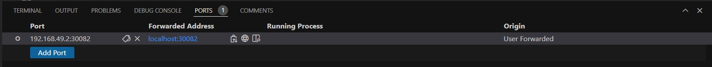
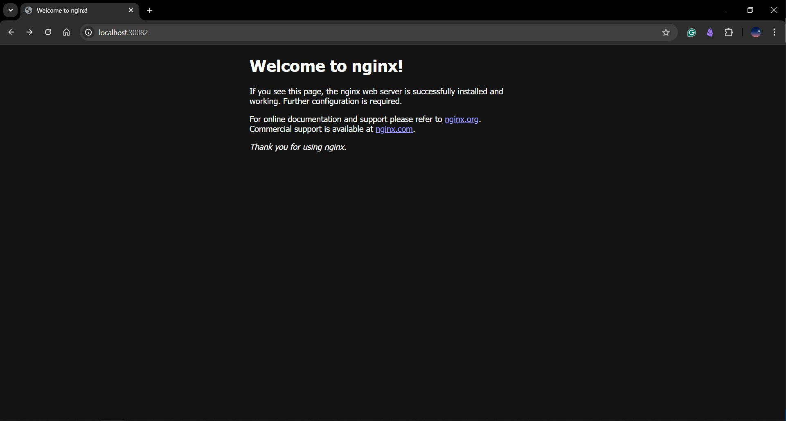

# Assignment 4 - Task 2 - Solution

**Trainee Name: Yasser Ahmed**  
**Group: ALX2_SWD1_G1**  

## Table of Contents

1. [Created DaemonSets](#1--install-k8s-cluster-minikube)
2. [How many `DaemonSets` are created in the cluster in all namespaces?](#2--how-many-daemonsets-are-created-in-the-cluster-in-all-namespaces)
3. [What DaemonSets exist on the `kube-system` namespace?](#3--what-daemonsets-exist-on-the-kube-system-namespace)
4. [What is the image used by the POD deployed by the `kube-proxy` DaemonSet?](#4--what-is-the-image-used-by-the-pod-deployed-by-the-kube-proxy-daemonset)
5. [Deploy a DaemonSet for FluentD Logging](#5--deploy-a-daemonset-for-fluentd-logging)
6. [Deploy a `pod` named `nginx-pod` using the `nginx:alpine` image with the labels set to `tier=backend`](#6--deploy-a-pod-named-nginx-pod-using-the-nginxalpine-image-with-the-labels-set-to-tierbackend)
7. [Deploy a test pod using the nginx:alpine image](#7--deploy-a-test-pod-using-the-nginxalpine-image)
8. [Create a `service` `backend-service` to expose the `backend` application within the cluster on `port 80`](#8--create-a-service-backend-service-to-expose-the-backend-application-within-the-cluster-on-port-80)
9. [Try to `curl` the `backend-service` from the `test-pod`. What is the response?](#9--try-to-curl-the-backend-service-from-the-test-pod-what-is-the-response)
10. [Create a deployment named `web-app` using the image `nginx` with 2 `replicas`](#10--create-a-deployment-named-web-app-using-the-image-nginx-with-2-replicas)
11. [Expose the web-app as service web-app-service application on port 80 and nodeport 30082 on the nodes on the cluster](#11--expose-the-web-app-as-service-web-app-service-application-on-port-80-and-nodeport-30082-on-the-nodes-on-the-cluster)
12. [Access the web app from the node](#12--access-the-web-app-from-the-node)
13. [How many static pods exist in this cluster in all namespaces?](#13--how-many-static-pods-exist-in-this-cluster-in-all-namespaces)
14. [On which nodes are the static pods created currently?](#14--on-which-nodes-are-the-static-pods-created-currently)

### 1- How many `DaemonSets` are created in the cluster in all namespaces?

none

```bash
yasser@kane:~/k8s$ k get ds
No resources found in default namespace.
```

---

### 2- what DaemonSets exist on the `kube-system` namespace?

kube-proxy

```bash
yasser@kane:~/k8s$ k get ds -n kube-system
NAME         DESIRED   CURRENT   READY   UP-TO-DATE   AVAILABLE   NODE SELECTOR            AGE
kube-proxy   1         1         1       1            1           kubernetes.io/os=linux   30h
```

---

### 3- What is the image used by the POD deployed by the `kube-proxy` DaemonSet

```bash
yasser@kane:~/k8s$ k get ds kube-proxy -n kube-system -o yaml | grep image
        image: registry.k8s.io/kube-proxy:v1.31.0
        imagePullPolicy: IfNotPresent
```

---

### 4- Deploy a DaemonSet for FluentD Logging. Use the given specifications. [Name: elasticsearch, Namespace: kube-system, Image: k8s.gcr.io/fluentd-elasticsearch:1.20]

```yaml
apiVersion: apps/v1
kind: DaemonSet
metadata:
  name: elasticsearch
  namespace: kube-system
  labels:
    k8s-app: elasticsearch-logging
spec:
  selector:
    matchLabels:
      name: elasticsearch
  template:
    metadata:
      labels:
        name: elasticsearch
    spec:
      containers:
      - name: elasticsearch
        image: k8s.gcr.io/fluentd-elasticsearch:1.20
        resources:
          limits:
            memory: 200Mi
          requests:
            cpu: 100m
            memory: 200Mi
        volumeMounts:
        - name: varlog
          mountPath: /var/log
          readOnly: true
      terminationGracePeriodSeconds: 30
      volumes:
      - name: varlog
        hostPath:
          path: /var/log
```

```bash
yasser@kane:~/k8s$ k create -f assignment-4/task-2/daemonset-fluentd.yaml 
daemonset.apps/elasticsearch created

yasser@kane:~/k8s$ k get ds -n kube-system
NAME            DESIRED   CURRENT   READY   UP-TO-DATE   AVAILABLE   NODE SELECTOR            AGE
elasticsearch   1         1         0       1            0           <none>                   3m49s
kube-proxy      1         1         1       1            1           kubernetes.io/os=linux   31h

yasser@kane:~/k8s$ k get pods -n kube-system -l name=elasticsearch
NAME                  READY   STATUS             RESTARTS   AGE
elasticsearch-qfv85   0/1     ImagePullBackOff   0          7m4s
yasser@kane:~/k8s$ k describe pod -n kube-system elasticsearch-qfv85
Name:             elasticsearch-qfv85
Namespace:        kube-system
Priority:         0
Service Account:  default
Node:             minikube/192.168.49.2
Start Time:       Mon, 10 Feb 2025 19:28:39 +0200
Labels:           controller-revision-hash=ff7769df
                  name=elasticsearch
                  pod-template-generation=1
Annotations:      <none>
Status:           Pending
IP:               10.244.0.56
IPs:
  IP:           10.244.0.56
Controlled By:  DaemonSet/elasticsearch
Containers:
  elasticsearch:
    Container ID:   
    Image:          k8s.gcr.io/fluentd-elasticsearch:1.20
    Image ID:       
    Port:           <none>
    Host Port:      <none>
    State:          Waiting
      Reason:       ImagePullBackOff
    Ready:          False
    Restart Count:  0
    Limits:
      memory:  200Mi
    Requests:
      cpu:        100m
      memory:     200Mi
    Environment:  <none>
    Mounts:
      /var/log from varlog (ro)
      /var/run/secrets/kubernetes.io/serviceaccount from kube-api-access-kkczx (ro)
Conditions:
  Type                        Status
  PodReadyToStartContainers   True 
  Initialized                 True 
  Ready                       False 
  ContainersReady             False 
  PodScheduled                True 
Volumes:
  varlog:
    Type:       EmptyDir (a temporary directory that shares a pod's lifetime)
    Medium:     
    SizeLimit:  <unset>
  kube-api-access-kkczx:
    Type:                    Projected (a volume that contains injected data from multiple sources)
    TokenExpirationSeconds:  3607
    ConfigMapName:           kube-root-ca.crt
    ConfigMapOptional:       <nil>
    DownwardAPI:             true
QoS Class:                   Burstable
Node-Selectors:              <none>
Tolerations:                 node.kubernetes.io/disk-pressure:NoSchedule op=Exists
                             node.kubernetes.io/memory-pressure:NoSchedule op=Exists
                             node.kubernetes.io/not-ready:NoExecute op=Exists
                             node.kubernetes.io/pid-pressure:NoSchedule op=Exists
                             node.kubernetes.io/unreachable:NoExecute op=Exists
                             node.kubernetes.io/unschedulable:NoSchedule op=Exists
Events:
  Type     Reason     Age                     From               Message
  ----     ------     ----                    ----               -------
  Normal   Scheduled  7m30s                   default-scheduler  Successfully assigned kube-system/elasticsearch-qfv85 to minikube
  Normal   Pulling    5m42s (x4 over 7m29s)   kubelet            Pulling image "k8s.gcr.io/fluentd-elasticsearch:1.20"
  Warning  Failed     5m38s (x4 over 7m24s)   kubelet            Failed to pull image "k8s.gcr.io/fluentd-elasticsearch:1.20": [DEPRECATION NOTICE] Docker Image Format v1 and Docker Image manifest version 2, schema 1 support is disabled by default and will be removed in an upcoming release. Suggest the author of k8s.gcr.io/fluentd-elasticsearch:1.20 to upgrade the image to the OCI Format or Docker Image manifest v2, schema 2. More information at https://docs.docker.com/go/deprecated-image-specs/
  Warning  Failed     5m38s (x4 over 7m24s)   kubelet            Error: ErrImagePull
  Warning  Failed     5m25s (x6 over 7m23s)   kubelet            Error: ImagePullBackOff
  Normal   BackOff    2m23s (x18 over 7m23s)  kubelet            Back-off pulling image "k8s.gcr.io/fluentd-elasticsearch:1.20"
```

---

### 5- Deploy a `pod` named `nginx-pod` using the `nginx:alpine` image with the labels set to `tier=backend`

```yaml
apiVersion: v1
kind: Pod
metadata:
  name: nginx-pod
  labels:
    tier: backend
spec:
  containers:
  - name: nginx
    image: nginx:alpine
```

```bash
yasser@kane:~/k8s$ k get pods
NAME        READY   STATUS    RESTARTS   AGE
nginx-pod   1/1     Running   0          2m16s
```

---

### 6- Deploy a test pod using the nginx:alpine image

#### test-pod.yaml

```yaml
apiVersion: v1
kind: Pod
metadata:
  name: test-pod
  labels:
    tier: backend
spec:
  containers:
  - name: nginx
    image: nginx:alpine
```

```bash
yasser@kane:~/k8s$ k create -f assignment-4/task-2/test-pod.yaml 
pod/test-pod created

yasser@kane:~/k8s$ k get pods
NAME        READY   STATUS    RESTARTS   AGE
nginx-pod   1/1     Running   0          5m22s
test-pod    1/1     Running   0          30s
```

---

### 7- Create a `service` `backend-service` to expose the `backend` application within the cluster on `port 80`

#### backend-service.yaml

```yaml
apiVersion: v1
kind: Service
metadata:
  name: backend-service
spec:
  selector:
    tier: backend       # Select all Pods with the label 'tier: backend'
  ports:
    - protocol: TCP
      port: 80          # Expose the service on port 80
      targetPort: 80    # Forward incoming requests on port 80 to port 80 of the target
  type: ClusterIP       # Expose the service on a cluster-internal IP
```

```bash
yasser@kane:~/k8s$ k create -f assignment-4/task-2/backend-service.yaml 
service/backend-service created

yasser@kane:~/k8s$ k get svc backend-service
NAME              TYPE        CLUSTER-IP     EXTERNAL-IP   PORT(S)   AGE
backend-service   ClusterIP   10.96.113.73   <none>        80/TCP    47s

yasser@kane:~/k8s$ k exec -it nginx-pod -- /bin/sh
/ # curl http://10.96.113.73:80
<!DOCTYPE html>
<html>
<head>
<title>Welcome to nginx!</title>
[...]
<p><em>Thank you for using nginx.</em></p>
</body>
</html>
/ # 
```

---

### 8- try to `curl` the `backend-service` from the `test-pod`. What is the response?

```bash
yasser@kane:~/k8s$ k exec -it test-pod -- /bin/sh
/ # curl http://10.96.113.73:80
<!DOCTYPE html>
<html>
<head>
<title>Welcome to nginx!</title>
[...]
<p><em>Thank you for using nginx.</em></p>
</body>
</html>
/ # 
```

---

### 9- Create a deployment named `web-app` using the image `nginx` with 2 `replicas`

#### deploy-web-app.yaml

```yaml
apiVersion: apps/v1
kind: Deployment
metadata:
  name: web-app
spec:
  replicas: 2
  selector:
    matchLabels:
      app: web-app
  template:
    metadata:
      labels:
        app: web-app
    spec:
      containers:
      - name: web-app
        image: nginx
        ports:
        - containerPort: 80
```

```bash
yasser@kane:~/k8s$ k create -f assignment-4/task-2/deploy-web-app.yaml 
deployment.apps/web-app created

yasser@kane:~/k8s$ k get deploy
NAME      READY   UP-TO-DATE   AVAILABLE   AGE
web-app   2/2     2            2           96s
```

---

### 10- Expose the web-app as service web-app-service application on port 80 and nodeport 30082 on the nodes on the cluster

#### web-app-service.yaml

```yaml
apiVersion: v1
kind: Service
metadata:
  name: web-app-service
spec:
  selector:
    app: web-app
  ports:
    - protocol: TCP
      port: 80
      targetPort: 80
      nodePort: 30082
  type: NodePort
```

```bash
yasser@kane:~/k8s$ k create -f assignment-4/task-2/web-app-service.yaml 
service/web-app-service created

yasser@kane:~/k8s$ k get svc
NAME              TYPE        CLUSTER-IP      EXTERNAL-IP   PORT(S)        AGE
backend-service   ClusterIP   10.96.113.73    <none>        80/TCP         29m
kubernetes        ClusterIP   10.96.0.1       <none>        443/TCP        32h
web-app-service   NodePort    10.99.181.234   <none>        80:30082/TCP   11s
```

---

### 11- access the web app from the node

```bash
yasser@kane:~/k8s$ minikube service web-app-service
|-----------|-----------------|-------------|---------------------------|
| NAMESPACE |      NAME       | TARGET PORT |            URL            |
|-----------|-----------------|-------------|---------------------------|
| default   | web-app-service |          80 | http://192.168.49.2:30082 |
|-----------|-----------------|-------------|---------------------------|
🎉  Opening service default/web-app-service in default browser...
👉  http://192.168.49.2:30082
```

#### VS code forward port




---

### 12- How many static pods exist in this cluster in all namespaces?


```bash

```

---

### 13-On which nodes are the static pods created currently?

