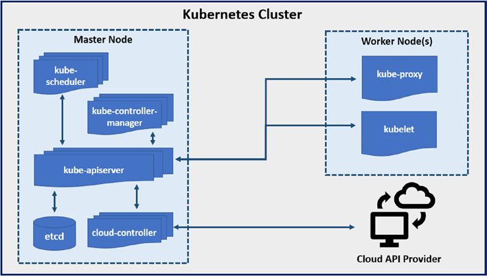

# DevOps Assignment 3.1

**Trainee Name: Yasser Ahmed**  
**Group: ALX2_SWD1_G1**  

## Table of Contents

1. [Theory Questions (10 points)](#theory-questions-10-points)
   - [a) Kubernetes Architecture](#a-kubernetes-architecture)
   - [b) Deployments and Services](#b-deployments-and-services)
   - [c) Scaling and Autoscaling](#c-scaling-and-autoscaling)

2. [Practical Task (15 points)](#practical-task-15-points)
   - [a) Create a Deployment](#a-create-a-deployment)
   - [b) Service Exposure](#b-service-exposure)
   - [c) Scaling with Autoscaling](#c-scaling-with-autoscaling)

## **Theory Questions (10 points)**

**a) Kubernetes Architecture**  
**b) Deployments and Services**  
**c) Scaling and Autoscaling**  

## a) Kubernetes Architecture

## **1. What are the core components of a Kubernetes cluster (e.g., master, node, etcd, kube-apiserver)? Briefly explain their roles**

A Kubernetes cluster commonly contains one or more master nodes and one or more worker nodes. Every Kubernetes cluster must have at least one worker node.

  
****Figure 1.*** Kubernetes architecture*

Figure 1 shows a typical Kubernetes cluster, highlighting three main components: the master node (also known as the control plane), the worker node, and the cloud API provider.

The master node is where all cluster management and execution decisions reside; it can be thought of as the mind of the Kubernetes cluster.

The worker node is where the pods are created and run, and a pod is the Kubernetes component inside which your application runs.

The master node is responsible for managing the worker nodes.

## Master Node (Control Plane)

The kube-apiserver component is the key component of the control plane or master node and is responsible for all the interactions within and outside of it.

The Kubernetes cluster runs on top of either a physical or virtual environment.

  
****Figure 2.*** Master node components*

### **What Does the Master Node Do?**

Master node components make scheduling and controlling decisions related to the cluster.

Simply put, the master node manages the whole Kubernetes cluster, which includes the worker nodes.

The following are a few examples of what master nodes do:

- Suppose a pod needs to be scheduled;
  - that scheduling decision will be made by the master node component.

- Suppose a pod is defined to have three replicas, but one pod has gone down.
  - The master node component will ensure that a new replica is created so that the specification of three replicas is met.

### **Master Node Components**

key components of a master node or control plane:  

- API server (kube-apiserver)
- Scheduler (kube-scheduler)
- Controller managers (kube-controller-manager)
- Data store (etcd)

---

#### **API Server (kube-apiserver)**

The `kube-apiserver` component **implements and exposes the Kubernetes API** and validates and configures data for the API objects.

The `kube-apiserver` component provides an entry point to the calls made using the Kubernetes REST API.

All the requests are targeted to `kube-apiserver`, whether coming from the worker node or any other channel.

The `kube-apiserver` component can be thought of as the front end of the Kubernetes master node.

`kube-apiserver` exposes an HTTP API, through which any component or client can communicate with the API server.

Most of the operations performed by the `kubectl` or `kubeadm` command-line interface use this Kubernetes API.

The Kubernetes API can also be accessed using REST calls.

**kube-apiserver is the only component of the control plane or master node with which the worker nodes interact.**

The `kube-apiserver` component can be **scaled horizontally** so that at any point in time you can deploy more kube-apiserver instances and load balance the incoming traffic between those kube-apiserver instances.

---

#### **Scheduler (kube-scheduler)**

The `kube-scheduler` component **contains all the scheduling algorithms** and makes all the scheduling-related decisions for the Kubernetes cluster.

whenever a request for a new pod or node comes in, the kube-scheduler component checks the current state of the Kubernetes cluster, checks if any limit is breached, etc., and accordingly makes the scheduling decision.

***Notes***

- The kube-scheduler component doesn’t launch the pod; it only selects the most suitable node for running the pod and writes the name of that node on the pod object.

- It is the kubelet component of the worker node that will pull the image, create the container, start the container, etc.

---

#### **Controller Manager (kube-controller-manager)**

The controller manager runs processes and controllers to regulate the state of the Kubernetes cluster.

They are continuous watch loops that compare the cluster’s existing state to the specified state, and in case of any mismatch between the states, corrective action is taken.

Suppose, for whatever reason, that a node comes down. The kube-controller-manager component will detect this failure and respond to it by rescheduling the pods running on that failed node to a healthy node.

The following are some types of kube-controller-managers:

- **Node controller:** Watch loop noticing and responding to node failures

- **Job controller:** Responsible for watching `job` and `cron-job` objects

- **Endpoint slice controller:** Responsible for managing `EndpointSlice`.

- **Service account controller:** Responsible for managing the `ServiceAccounts` inside `namespaces`

---

#### **Data store (etcd)**

etcd is a distributed key-value store that stores and manages all the vital data required for any distributed system to function.

Kubernetes is among the most popular use cases of etcd; in Kubernetes, etcd is used to store and manage the config data and data related to the Kubernetes cluster state.

etcd is not used to store any sort of client application data.

### **cloud-controller-manager**

The `cloud-controller-manager` component lets you manage your cloud provider’s API.

If you are not running your Kubernetes cluster on cloud infrastructure, then you might not need this component.

The way `kube-controller-manager` component runs controllers that manage and regulate core Kubernetes resources, and cloud-controller-manager runs controllers that manage and regulate cloud provider resources.

For example, if you want to use a cloud provider’s load balancer or persistent storage, it will be provisioned and managed using a cloud-controller-manager component.

The cloud-controller-manager component was added to the Kubernetes architecture as part of Kubernetes v1.6. Before that, its functionality was part of `kube-controller-manager`. This was separated to decouple the core Kubernetes design and code from the cloud providers.

---

## **Worker Node**

Worker node is a kubernetes cluster run containerized applications.

  
****Figure 3.*** Worker node components*

### Worker Node Components

Every worker node within a Kubernetes cluster must run three services:

- Node agent (kubelet)
- Node agent (kube-proxy)
- Container runtime

---

### **Node agent (kubelet)**

kubelet is the main node agent that runs on every worker node of the Kubernetes cluster.

The kubelet node agent enables the interfacing between kube-apiserver and the worker nodes.

This kubelet node agent is also responsible for managing pod requirements such as mounting volumes, starting containers, and reporting status.

A PodSpec, which is just a JSON or YAML object describing the specification of a pod, is the object on which kubelet depends to work.

kube-apiserver sends pod specifications to kubelet, and then it is the responsibility of kubelet to ensure that all the containers are running as per the requirements defined in that pod specification.

kubelet registers the node with the API server.

It is the kubelet component of the worker node that pulls the image (either from the image registry or from a pre-downloaded image from the local system), creates the container, and starts the container, as you can see in the following output.

kubelet does not manage containers that are not created by Kubernetes.

---

### **Node agent (kube-proxy)**

Each worker node runs a network proxy, known as kube-proxy, that is responsible for all networking-related things on the worker nodes.

kube-proxy is responsible for the maintenance of all the networking-related rules and uses them to enable pod communication from within and outside the cluster.

---

### **Container Runtime**

The container runtime is the piece of software that knows how to create and run containers from a container image.

Kubernetes needs an underlying container runtime to manage the life cycle of containers.

---

## **What is a pod in Kubernetes, and how does it differ from a Docker container?**

In Kubernetes, pods are the smallest and most fundamental deployable unit. Within a pod, you can find one or more containers, and all containers will share the network and storage associated with the pod.

### **How is a Pod Different from a Docker Container?**

| **Aspect**               | **Docker Container**                                                                 | **Kubernetes Pod**                                                                                   |
|--------------------------|-------------------------------------------------------------------------------------|-----------------------------------------------------------------------------------------------------|
| **Scope**                | A single container runtime instance.                                                | A group of one or more containers that share resources and are managed as a single unit.            |
| **Networking**           | Each container has its own network namespace.                                       | Containers in a Pod share the same network namespace (IP and port space).                           |
| **Storage**              | Volumes can be attached to individual containers.                                   | Volumes are shared among all containers in the Pod.                                                 |
| **Lifecycle**            | Managed individually by Docker.                                                    | Managed collectively by Kubernetes. If one container fails, the entire Pod is affected.             |
| **Use Case**             | Ideal for running a single process or application.                                 | Ideal for running tightly coupled processes that need to share resources (e.g., app + logging agent).|
| **Orchestration**        | Docker alone does not provide orchestration capabilities.                          | Pods are orchestrated by Kubernetes, which handles scaling, scheduling, and self-healing.           |
| **Isolation**            | Containers are isolated from each other by default.                                | Containers in a Pod are not isolated and can communicate directly via `localhost`.                  |
| **Self-Healing**         | Not built-in. Requires external tools or manual intervention.              | Built-in. Automatically restarts failed containers and replaces failed Pods.                         |
| **Health Monitoring**    | No built-in health checks.                                                 | Uses liveness and readiness probes to monitor container health.                                       |
| **Failure Recovery**     | Containers remain stopped until manually restarted.                        | Automatically restarts containers and replaces Pods to maintain the desired state.                    |
| **Node Failures**        | No automatic recovery. Containers on a failed node are lost.               | Reschedules Pods from failed nodes to healthy nodes.                                                 |
| **Desired State**        | No concept of desired state. Containers run as configured.                 | Continuously ensures the actual state matches the desired state defined in the configuration.         |
| **Scalability**          | Limited to manual scaling or external tools.                               | Automatically scales Pods and ensures high availability through self-healing.                         |

---

## b) Deployments and Services

## **Explain the purpose of a Kubernetes deployment. How do deployments ensure high availability of applications?**

Deployment is a workload resource that provides declarative updates for pods and replica sets.

Deployment is the object that defines specifications for the deployment of your application.

Using the Deployment object, you describe the desired deployment state of your application, and then at runtime, a deployment controller (a component of the master node) will make sure that the actual state matches the desired state.

When you create a Deployment object for the first time, a new set of pods and a new ReplicaSet are created.

When you remove the Deployment object, all pods and replicasets are removed.

Deployment directly manages the ReplicaSet it creates.

### **How do deployments ensure high availability of applications?**

`deployments` use `ReplicaSet` to ensure high availability of the applications.

`ReplicaSet` guarantees the availability of a specified number of running pods.

---

## **What are the different types of services in Kubernetes (e.g., ClusterIP, NodePort, LoadBalancer)? When would you use each type?**

### **ClusterIP**

With the Service type ClusterIP, Kubernetes assigns an IP address to the Service that is internal to the cluster.

That's why the Service type ClusterIP is used when you want to expose your application within the cluster and not outside of the cluster.

```yaml
apiVersion: v1
kind: Service
metadata:
  name: my-clusterip-service
spec:
  type: ClusterIP
  ports:
    - port: 80
      targetPort: 8080
  selector:
    app: my-app
```

### **NodePort**

Exposes the Service on a static port on each node's IP address.

Allows external traffic to access the Service by targeting any node's IP address and the assigned NodePort.

Automatically creates a ClusterIP Service to route traffic internally.

Use when you need external access but don't have a LoadBalancer.

Suitable for development, testing, or environments without cloud load balancers.

```yaml
apiVersion: v1
kind: Service
metadata:
  name: my-nodeport-service
spec:
  type: NodePort
  ports:
    - port: 80
      targetPort: 8080
      nodePort: 30007
  selector:
    app: my-app
```

### **LoadBalancer**

Exposes the Service externally using a cloud provider's load balancer.

Automatically assigns an external IP address and routes traffic to the Service.

Creates a NodePort and ClusterIP Service internally.

Use when you need to expose a Service to the public internet.

Best for production environments with cloud provider support.

```yaml
apiVersion: v1
kind: Service
metadata:
  name: my-loadbalancer-service
spec:
  type: LoadBalancer
  ports:
    - port: 80
      targetPort: 8080
  selector:
    app: my-app
```

### **ExternalName**

Maps a Service to an external DNS name (e.g., a service outside the cluster).

Does not create a ClusterIP or proxy traffic. Instead, it acts as a DNS alias.

Use when you need to map a Service to an external resource.

Useful for integrating with external APIs or databases.

```yaml
apiVersion: v1
kind: Service
metadata:
  name: my-externalname-service
spec:
  type: ExternalName
  externalName: my.external-service.com
```

### **Comparison Table**

| **Service Type** | **Access Scope**       | **Use Case**                                                                 | **Example**                                   |
|------------------|------------------------|-----------------------------------------------------------------------------|-----------------------------------------------|
| **ClusterIP**    | Internal to the cluster| Exposing services for internal communication.                               | Database service for backend microservices.   |
| **NodePort**     | External via node IP   | Exposing services for external access in development or testing.            | Web application during development.           |
| **LoadBalancer** | External via cloud LB  | Exposing services to the public internet in production environments.        | Production web application.                   |
| **ExternalName** | External DNS           | Mapping a Kubernetes Service to an external service.                        | External API or database.                     |

## c) Scaling and Autoscaling

### **How does Kubernetes handle scaling? Explain the concept of Horizontal Pod Autoscaler and how it responds to workload changes.**

Scaling in Kubernetes can be done manually or automatically using the Horizontal Pod Autoscaler (HPA)

#### **1. Manual Scaling**

updating the replicas field in the YAML configuration or using the `kubectl scale` command.

```bash
kubectl scale <<<DEPLOYMENT_NAME>>> --replicas=10
```

#### **2. Automatic Scaling**

Kubernetes provides Horizontal Pod Autoscaler (HPA) to automatically scale the number of Pods based on observed metrics like CPU utilization, memory usage, or custom metrics.

This ensures that your application can handle increased traffic without manual intervention and reduces resource usage during low traffic periods.

In your Kubernetes cluster, if horizontal autoscaling is enabled, you can configure autoscaling using the `kubectl autoscale` command.

The following command will set autoscaling to maintain an average CPU utilization of 40 percent across all pods. This autoscaler configuration will create a maximum number of 15 pods and a minimum number of 10 pods to maintain 40 percent CPU utilization.

```bash
kubectl autoscale deploy <<<DEPLOYMENT_NAME>>> --min=10 --max=15 --cpu-percent=40
```

If at any point in time you want to check the current status of the autoscaler, then you can use the `kubectl get hpa` command.

---

## **Practical Task (15 points)**

**a) Create a Deployment**  
**b) Service Exposure**  
**c) Scaling with Autoscaling**  

## a) Create a Deployment  

- Create a Kubernetes deployment that runs 3 replicas of the web server container from Assignment 2.
- Ensure that all replicas are load-balanced across the cluster using a ClusterIP service.
- Describe how you would test the load balancing functionality.

### **deploy-web-server.yaml**

```yaml
apiVersion: apps/v1
kind: Deployment
metadata:
  name: deploy-web-server
spec:
  replicas: 3
  selector:
    matchLabels:
      app: web-server
  template:
    metadata:
      labels:
        app: web-server
    spec:
      containers:
      - name: deploy-web-server-c
        image: nginx
        ports:
        - containerPort: 80
```

### **clusterip-web-server.yaml**

```yaml
apiVersion: v1
kind: Service
metadata:
  name: service-web-server
spec:
  type: ClusterIP
  selector:
    app: web-server
  ports:
    - protocol: TCP
      port: 80
      targetPort: 80
```

```bash
yasser@kane:~/k8s$ k create -f assignment-4/task-3.1/
service/service-web-server created
deployment.apps/deploy-web-server created

yasser@kane:~/k8s$ k get deploy deploy-web-server
NAME                READY   UP-TO-DATE   AVAILABLE   AGE
deploy-web-server   3/3     3            3           4m2s

yasser@kane:~/k8s$ k get svc service-web-server
NAME                 TYPE        CLUSTER-IP      EXTERNAL-IP   PORT(S)   AGE
service-web-server   ClusterIP   10.97.156.144   <none>        80/TCP    4m20s
```

---

### **b) Service Exposure**

- Expose your deployment to the outside world using a NodePort service. Map the external port to 80 on the Kubernetes cluster.
- Verify the service is reachable by accessing the external IP and port from your browser.

```yaml
apiVersion: v1
kind: Service
metadata:
  name: web-server
spec:
  type: NodePort
  selector:
    app: web-server
  ports:
    - protocol: TCP
      port: 80
      targetPort: 80
      nodePort: 31111
```

```bash
yasser@kane:~/k8s$ k create -f assignment-4/task-3.1/nodeport-web-server.yaml 
service/web-server created

yasser@kane:~/k8s$ k get svc web-server
NAME         TYPE       CLUSTER-IP       EXTERNAL-IP   PORT(S)        AGE
web-server   NodePort   10.105.216.143   <none>        80:31111/TCP   82s

yasser@kane:~/k8s$ minikube service web-server
|-----------|------------|-------------|---------------------------|
| NAMESPACE |    NAME    | TARGET PORT |            URL            |
|-----------|------------|-------------|---------------------------|
| default   | web-server |          80 | http://192.168.49.2:31111 |
|-----------|------------|-------------|---------------------------|
🎉  Opening service default/web-server in default browser...
👉  http://192.168.49.2:31111
```


---

## **c) Scaling with Autoscaling**

- Set up the Kubernetes Horizontal Pod Autoscaler (HPA) to automatically scale the web server deployment up to 10 replicas when CPU utilization exceeds 70%.

- Simulate high CPU usage using kubectl or a stress test tool, and observe how Kubernetes scales the pods.

```bash
yasser@kane:~/k8s$ k autoscale deploy deploy-web-server --min=3 --max=10 --cpu-percent=70
horizontalpodautoscaler.autoscaling/deploy-web-server autoscaled

yasser@kane:~/k8s$ k get hpa deploy-web-server
NAME                REFERENCE                      TARGETS              MINPODS   MAXPODS   REPLICAS   AGE
deploy-web-server   Deployment/deploy-web-server   cpu: <unknown>/70%   3         10        3          40s
```

### **To Simulate high CPU usage**

```bash
yasser@kane:~/k8s$ k get pods
NAME                                 READY   STATUS             RESTARTS       AGE
deploy-web-server-6849b7b794-5w29h   1/1     Running            0              37m
deploy-web-server-6849b7b794-bzz7r   1/1     Running            0              37m
deploy-web-server-6849b7b794-wmcwx   1/1     Running            0              37m

yasser@kane:~/k8s$ k exec -it deploy-web-server-6849b7b794-bzz7r -- /bin/sh
# apt-get update && apt-get install -y stress
[omitted for brevity]
Setting up stress (1.0.7-1) ...

# stress --cpu 2 --timeout 300s
stress: info: [158] dispatching hogs: 2 cpu, 0 io, 0 vm, 0 hdd


yasser@kane:~/k8s$ k get hpa deploy-web-server --watch
NAME                REFERENCE                      TARGETS              MINPODS   MAXPODS   REPLICAS   AGE
deploy-web-server   Deployment/deploy-web-server   cpu: <unknown>/70%   3         10        3          14m
```
